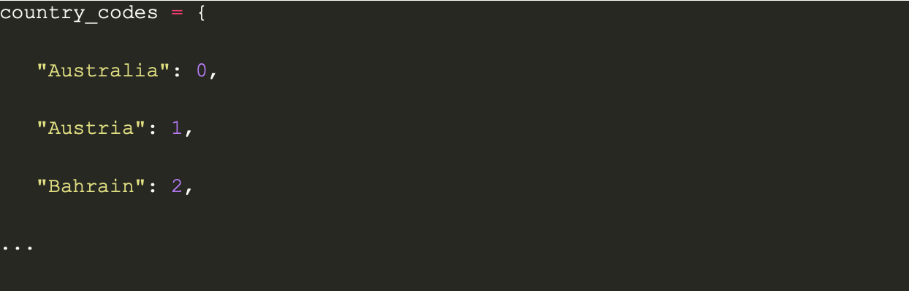
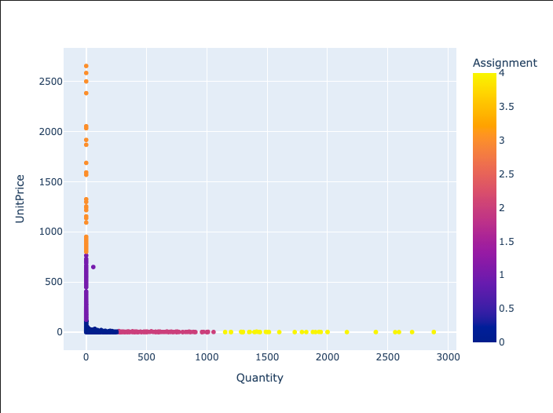
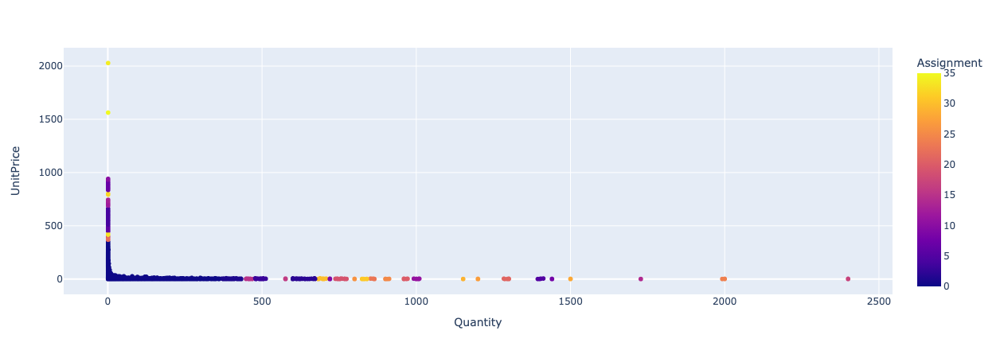
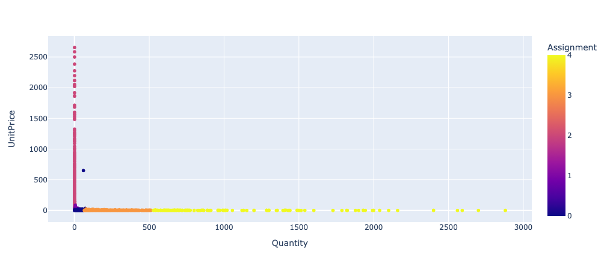

# Introduction
E-commerce has become one of the most popular fields of global marketing [1]. It is a common method to collect and analyze big data on E-commerce sales to predict the performance of a product in E-commerce platforms [2]. A previous study has successfully predicted daily product sales using CatBoost [3]. Another previous study uses a mix of Random Forest, Gradient Boosting, and k-Nearest Neighbors to anticipate potential purchases by a new customer [4]. We will use machine learning concepts to analyze a dataset from [Kaggle](https://www.kaggle.com/datasets/carrie1/ecommerce-data/data) with sales data of an E-commerce platform in the UK. The dataset has specific product descriptions, quantity, unit price, customer ID, country, invoice number, stock code, and the date of each sale. The invoice number can be used in identifying each purchase, and the stock code distinguishes each unique item.
# Problem Definition
With the advancement of technology and the freight industry, the E-commerce market has become more competitive. While achieving maximum margin on every sale, it is important for the vendors to retain their customers against their competitors. Thus, the vendors need a good pricing policy in order to optimize long term revenue. This project aims to compare the effectiveness of different clustering methods on the products based on the unit price and purchased quantity to help the vendors price the merchandise based on the clustering results. This problem definition has changed since we created our project proposal. The reason for this change is that while implementing the ML models for the project, we realized that the dataset we have selected is not optimal for conducting direct price prediction based on item description, but it is suitable for a cluster-based price prediction. 

# Methods
### Data Preprocessing Methods: 

Our dataset had a couple of flaws which we have fixed through data preprocessing. First, we performed dimensionality reduction on features such as stock code and invoice date, which are irrelevant to our research. Next, we performed a small data transformation transforming string country names into numerical country codes. Finally, we preprocessed our dataset via data cleaning, eliminating irrelevant rows such as customer returns that resulted in negative quantity values. This information is irrelevant to our defined problem, so we scrubbed these out from our dataset. 

We used Pandas to convert our CSV file into an easy to work with dataframe. We changed the country names into country codes using a dictionary, where we simply numbered the countries in the dataframe from 0 to the number of countries in alphabetical order:

We did this to clean our data and ensure easier data analysis so that we are not running through strings, but integers. From there, we dropped the irrelevant columns (StockCode and InvoiceDate). This is an example of dimensionality reduction of dimensions that we don’t need and should not be a part of our database. We deleted rows that had negative quantities and duplicates, as that could ruin the results of our data because of an imbalance of data. We also deleted outliers because we noticed there were some unusual quantities that threw off the results of the data, especially the invoices for thousands of e-commerce items. Hence our data became more balanced, and we could run learning methods without having to worry about imbalanced data. We accomplished all of this using Pandas dataframe manipulation and methods. We returned the preprocessed dataframe so that we can use this dataframe in our Jupyter notebooks.

### ML Algorithms:
In this project, we aim to compare three different clustering algorithms and compare the effectiveness of each. We have implemented 3 different clustering algorithms: K-means, DBscan, and GMM.  

First, we used **K-means** to cluster our data. K-means is an unsupervised learning technique that can effectively cluster large amounts of data due to its quick convergence. It allows us to quickly spot patterns in the data, which became very apparent in the visualizations. It is a good starting point, as the clusters found can be utilized when forming features for supervised learning models. 

Using **DBSCAN**, we clustered our data based on the density of the data. DBSCAN, also known as density-based spatial clustering of applications with noise, is another unsupervised learning algorithm that clusters based on how close a datapoint is to another. Using two hyperparameters that we set, eps and minPts, we can alter how many clusters our data will produce and how effective the clustering is. Eps represents the radius where points are considered neighbors while minPts is the minimum amount of neighbors required to be considered a dense region. We are also easily able to find outliers because DBSCAN easily marks outliers as noise. We use DBSCAN to find clusters in the data based solely on the structure of the data rather than relying on the shapes of clusters.

Finally, we used a **Gaussian Mixture Model**. By using a GMM, we were able to further cluster our datapoints. We used a GMM specifically because it allowed for soft assignment– giving us a numerical probability value to quantify the assignment likelihood. This is important because the other two algorithms, K-means and DBSCAN, perform hard assignments. Another reason is the shapes in the data that it can capture. In our 2D case, K-means captures circular shapes and DBSCAN captures shapes based on datapoint density. However, a GMM allows for the capture of elliptical clusters, which seems to make up our dataset. Because of these differences from the previous algorithms, we decided to try using a GMM to cluster our datapoints.

 
# Potential Results and Discussion
**K-means**
K-means Visualization on Processed Data:

<table>
  <tr>
    <th>Color</th>
    <th>Cluster Description</th>
  </tr>
  <tr>
    <td>Orange</td>
    <td>High Price Low Quantity</td>
  </tr>
  <tr>
    <td>Purple</td>
    <td>Moderate price Low quantity  </td>
  </tr>
  <tr>
    <td>Blue</td>
    <td>Low price Low quantity</td>
  </tr>
  <tr>
    <td>Pink</td>
    <td>Low Price Moderate quantity </td>
  </tr>
 <tr>
    <td>Yellow</td>
    <td>Low price high quantity </td>
  </tr>
</table>

The visualization of the K-means clustering reflects different clusters in 5 colors. As we can see from the plot above, our processed data is extremely imbalanced. Products with high unit price are never bought at high quantities, which deviates from the clusters that we have proposed before. This imbalance does not largely affect the implemented K-means method, but it might influence the performance of other ML models to be implemented in the future.

To evaluate the effectiveness of our K-means clustering method, we used silhouette score, which is an example of quantitative metrics that evaluates the effectiveness of clustering. This is a new evaluation metric that we introduced as we progress in the project, which is the reason why it was not originally included in the project proposal. We implemented a function to calculate the **Silhouette Score[-1,1]** of our data points. The mean score across all data points is equal to **~0.732**. A high Silhouette Score indicates that our clusters are well-separated and cohesive. A score of 0.732 is in the upper quartile of the range of the score that ranges from -1 to 1, thus considered high, indicating good performance of K-means clustering.

Our hypothesis for the slightly imperfect performance is that it could be a result of the imbalance in our data. Silhouette Score measures the difference between the average distance from a point to points in the nearest different cluster and the average distance from the point to other points in the same cluster. With imbalanced data, the distance between points in the same cluster are bigger on average, resulting in a smaller Silhouette Score.

**DBSCAN**

The visualization of the DBSCAN clustering reflects 11 different clusters, with EPS tuned to 10 and MinPts tuned to 3. The parameters are tuned visually to best represent clusters based on the purchase quantity and unit price dependencies. 

To evaluate the effectiveness of our DBSCAN clustering method, we maintained our use of Silhouette score to ensure consistency. The mean score across all data points is equal to **~0.633**. A high Silhouette Score indicates that our clusters are well-separated and cohesive. A score of **0.633** is in the lower upper quartile of the range of the score that ranges from -1 to 1. This indicates a slightly declined performance compared to the K-means algorithm. 

The Silhouette score for DBSCAN is interesting, since the score measures how similar a point is to its own cluster compared to other clusters. Due to the nature of DBSCAN, we have smaller clusters that result in increased compactness. Our hypothesis for the comparatively low performance of DBSCAN is that the smaller clusters cause less inter-cluster separation. The smaller and more compact clusters might not separate from other small clusters, negatively impacting the Silhouette score. 

**GMM**

We also implemented a GMM clustering model to fit our data. With K = 5 and 10 maximum iterations, we generated the visual output above. To account for the imbalance in the data, we decided to take the **natural log** on the UnitPrice factor to better visualize the data and the cluster separation. Below is the semi-logarithm plot:

As we can see from the visualization, there is one cluster (cluster number 1) that includes significantly less points than the other clusters. This cluster lies in between cluster 0 and cluster 2. The clusters are generated by taking the maximum clustering assessment probabilities. Our hypothesis for this situation is that due to a poor initialization, GMM converged to a local optima, failing to find the global optima for this small group of data points. Considering the size and the proximity to other clusters, we will omit cluster 2 and assign it to cluster 0 and 1 based on the next highest probability. 

The assessed Silhouette score for the GMM output is **~ 0.399**. This output is interesting, considering the clear separation between the clusters. We suspect this score is brought down by the data points assigned to cluster 4, which we can see in our visualization, is very sparsely distributed, while the objective of this project is to obtain more compact clusters.

**Conclusion and Side-by-Side Comparison**

<table>
  <tr>
    <th>Model</th>
    <th>K-means</th>
    <th>DBSCAN</th>
    <th>GMM</th>
  </tr>
  <tr>
    <td>Strength</td>
    <td>Specified number of clusters, fits our classification needs of 5 price-quantity classifications</td>
    <td>DBSCAN is able to identify the outliers as noise without interfering with the main clusters </td>
    <td>GMM is able to handle elliptical clusters of varying sizes and densities, this is beneficial when we have imbalance datasets that does not come in spherical shapes</td>
  </tr>
  <tr>
    <th>Limitations</th>
    <th>K-means assumes clusters are spherical and equally sized, which is unrealistic for many datasets, especially our dataset as well</th>
    <th>DBSCAN struggles with clusters of varying densities, which unfortunately is the case with our dataset</th>
    <th>GMM is sensitive to local initialization and can converge to local optima, which can lead to what we are seeing with cluster number 2 that we have discussed before (insignificant cluster)</th>
  </tr>
  <tr>
    <th>Evaluation Metric (Silhouette Score)</th>
    <th>0.732</th>
    <th>0.633</th>
    <th>0.399</th>
  </tr>
</table>

Based on the side-to-side comparison between three algorithms, we have concluded that the K-means algorithm is the best-fit algorithm for our clustering purpose. K-mean scored the best Silhouette Score out of all three algorithms, it is fast for our low-dimensional data, and it has the most balanced clusters of the Unit price-Quantity data. DBSCAN struggles to return a proper number of clusters due to the varying density and imbalance in the data. While GMM returns a better separation boundary, it faces challenges when applying the correct cluster assignment to the points.

**Next Steps**

The provision of this project is to be able to use the best cluster assignment to incorporate in price prediction for the vendors, which is the potential next step for this project after the semester concludes.

# References
[1] V. Jain, B. Malviya, and S. Arya, “An overview of electronic commerce (e-Commerce),” CIBG, vol. 27, no. 3, pp. 665-670, June 2021.\
\
[2] S. Akter. and S. F. Wamba, “Big data analytics in E-commerce: a systematic review and agenda for future research,” Electronic Markets, vol. 26, pp. 173-194, March 2016.\
\
[3] L. Fink, “E-Commerce Sales Forecast,” Kaggle.com, April 2020. https://www.kaggle.com/code/allunia/e-commerce-sales-forecast (accessed Oct. 04, 2024).\
\
[4] F. Daniel, “Customer Segmentation,” Kaggle.com, September 2017. https://www.kaggle.com/code/fabiendaniel/customer-segmentation
\
\
‌[5] Shruti Shakhla, "Stock Price Trend Prediction Using Multiple Linear Regression ," International Journal of Engineering Science Invention (IJESI), vol. 07, no. 10, pp 29-33, October 2018.\

# [Gantt Chart](https://gtvault-my.sharepoint.com/:x:/g/personal/kli440_gatech_edu/EWDq6C0G9khHpryK7kYbtaoBYhsWRhtu8L8vTQ-xxB6EHg?e=DscwQX)
# Contribution Table
<table>
  <tr>
    <th>Member</th>
    <th>Contribution</th>
  </tr>
  <tr>
    <td>Chan-min</td>
    <td>Overall report and slides editing, video presentation</td>
  </tr>
  <tr>
    <td>Joseph</td>
    <td>GMM Implementation, Visualization, and GMM Method section, Slides</td>
  </tr>
  <tr>
    <td>Jiwon</td>
    <td>
Data Preprocessing Method Implemented, DBscan Implementation and Visualization

</td>
  </tr>
  <tr>
    <td>Keke</td>
    <td>Potential Result and discussion writeup, organizing Git page, slides</td>
  </tr>
</table>

# [Video Link](https://www.youtube.com/watch?v=SYjNuwsSO_Y)
